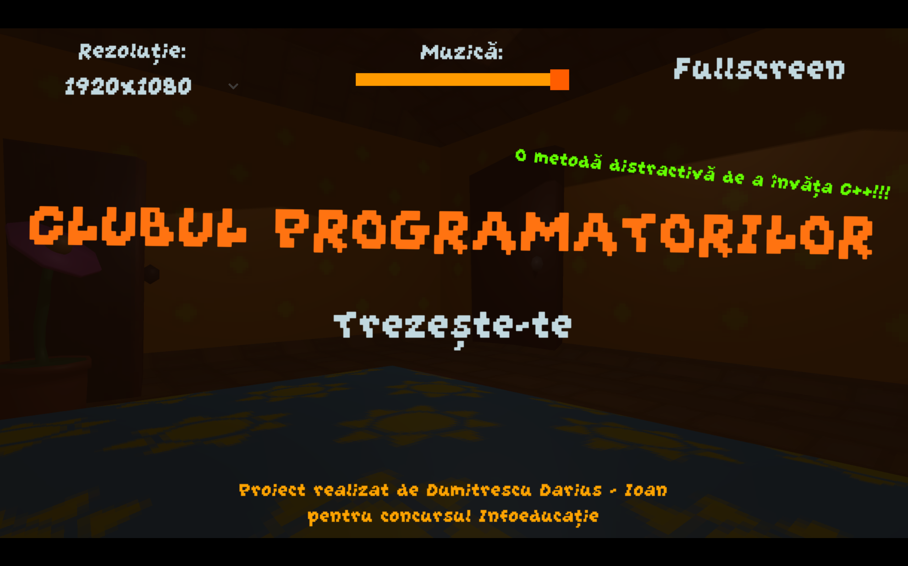
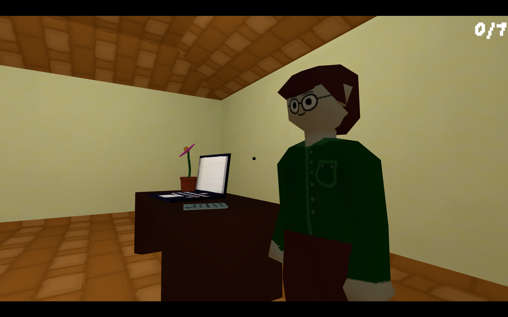
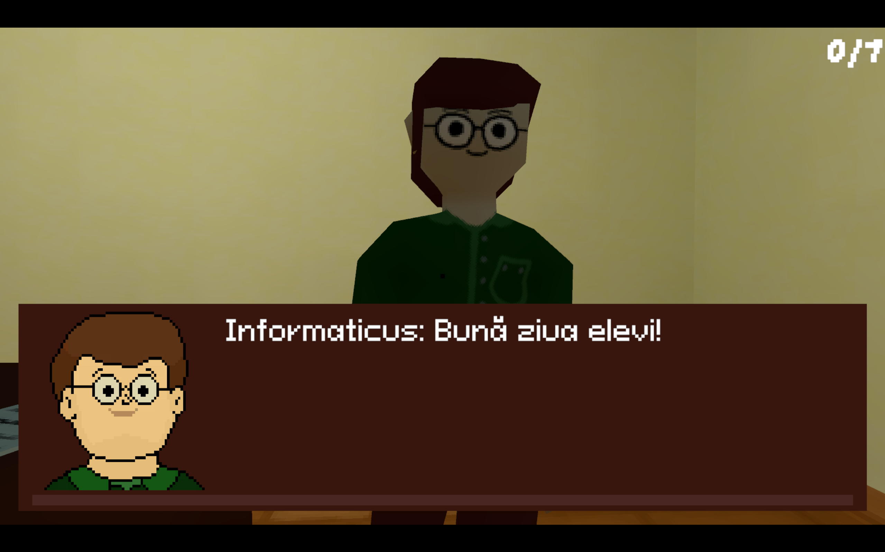

# Documentație Clubul Programatorilor
### Proiect realizat de către Dumitrescu Darius – Ioan, Colegiul Național Mircea cel Bătrân, Rm. Vâlcea

# informații generale despre proiect:

Clubul Programatorilor este un Soft Educațional creat în Unity cu scopul de a iniția copiii de gimnaziu în bazele programării în C++. Prin muzică spontană, dialoguri educative și întrebări de tip Quiz, acest proiect are scopul de a fi atât nostim, cât și didactic. Este prezentat într-un stil retro, similar jocurilor contemporane cum ar fi Minecraft, Undertale și Roblox, cu care copiii s-au familiarizat de-a lungul anilor. 

Jucătorul participă în Clubul Programatorilor, un loc unde fiecare membru este dornic să-și împărtășească cunoștințele și unde la sfârșit vei fi testat din informațiile pe care le-ai acumulat. După ce îl asculți pe unul dintre cele șapte personaje, o să-ți fie reprezentat pe telefonul tău digital un exemplu de cod în limbajul C++. Apoi, vei fi întrebat din lecția explicată, iar testul final este condiționat de a răspunde corect la fiecare membru. Înainte de testul final, ești avertizat în cazul în care nu ai răspuns corect tuturor personajelor.

După testul final, rezultatul va fi afișat, iar scorul tău maxim va fi memorat, astfel încât utilizatorul să încerce să obțină o notă cât mai bună într-un timp minim.
## Conceptul acestui Soft Educațional este să îndeplinească doua funcții foarte importante:
  
-	Transmiterea de cunoștințe într-un mod diferit, care să capteze atenția spre elementele educative dificile într-un mod ușor de înțeles. Utilizatorii se simt între prieteni cu personajele reprezentate ca elevi și profesori, aceștia având disponibilitatea de a explica de oricâte ori este nevoie pentru a  fi înțelese. Astfel, în aplicație sunt însușite noțiunile teoretice care stau la baza testului.
-	Testarea cunoștințelor acumulate în urma parcurgerii softului educațional și crearea unei competiții cu tine însuți pentru un rezultat cât mai bun. Performanța este răsplătită printr-o diplomă oferită utilizatorului.

Parcurgerea acestui soft educațional de către utilizator și promovarea testului final, având aspectul unui joc, permite acumularea cunoștințelor dintr-un curs de programare pentru începători într-un mod atractiv. Apoi, cunoștințele dobândite permit participarea cu rezultate bune la concursuri județene și naționale de programare.

# Ghid de instalare și utilizare a aplicației

## 1.	Ghid de instalare:
După ce se descarcă fișierul WIN-RAR și se dezarhivează, trebuie să intrăm în fișierul “ClubulProgramatorilor” și să accesăm executabilul “ClubulProgramatorilor.exe”.

## 2.	Ghid de utilizare:
După ce se deschide programul, trebuie va fi aflișată interfața de intrare. 

În continuare, apăsând pe butonul “Trezește-te” vei fi dus în camera elevului, de unde vei fi ghidat în continuare.

În sala de clasă, vei întâlni pe cei 7 membri din Clubul Programatorilor  
După ce sunt prezentate aspectele teoretice de către fiecare membru și se răspunde corect la întrebările acesora, utilizatorul va primi acces la testul final, un set de 15 întrebări quiz.

În final, utilizatorul va primi o diplomă pe care scrie scorul obținut și timpul total.

# Arhitectura aplicației

Scripturile acestui soft educațional au fost codate în limbajul de programare C# folosind Visual Studio Code.

Modele 3D sunt creații originale ce au fost realizate folosind programul Blender, iar texturile 2D pixelate au fost create cu ajutorul programului Aseprite.

Muzica a fost compusă folosind AI-ul Mubert, pentru care mi-a fost oferită [licență](https://acrobat.adobe.com/id/urn:aaid:sc:EU:e54d9b56-6391-4deb-8095-4f4d425d525c).

Animațiile 3D au fost construite folosind programul Adobe Mixamo.

# Justificarea tehnologiilor alese

Programul a fost realizat cu game engine-ul __Unity__. Am folosit acest game engine în așa fel încât să pot avea libertate totală în crearea softului educațional. 

Am utilizat __Text Mesh Pro__ pentru redactarea scrisului, pentru că are o funcționalitate multiplă, permițându-mi să utilizez fonturi diverse și să pot modifica textul din interiorul scirptului.

Am folosit __Pro Builder__ pentru a construi camerele din interiorul game engine-ului Unity, ceea ce mi-a permis să realizez cu ușurință obiecte gata texturate.

